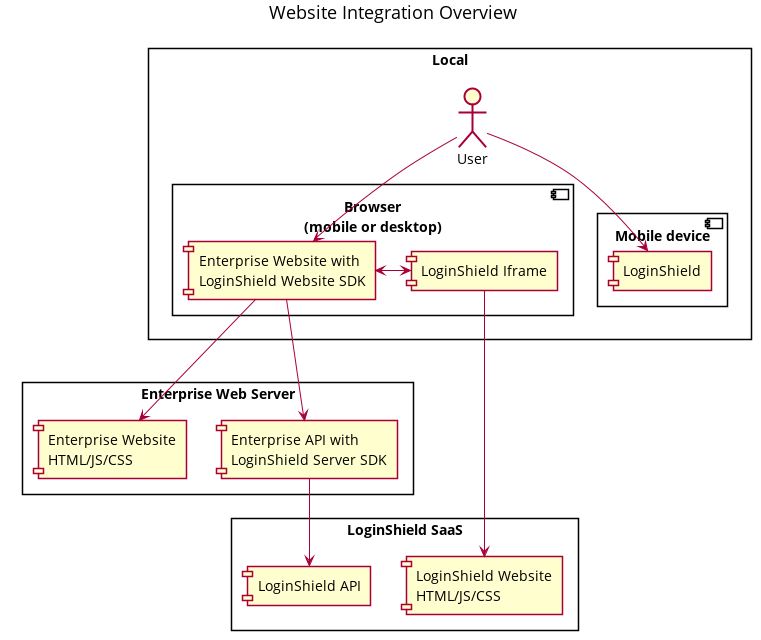
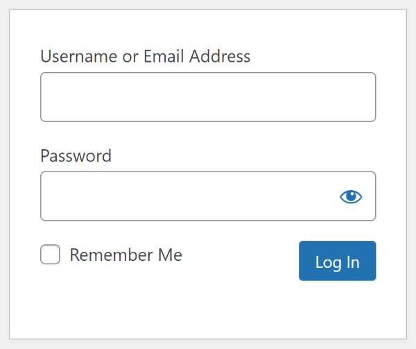
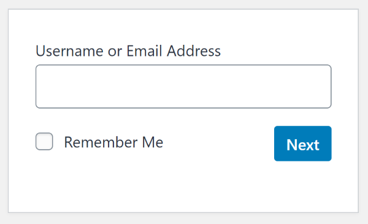
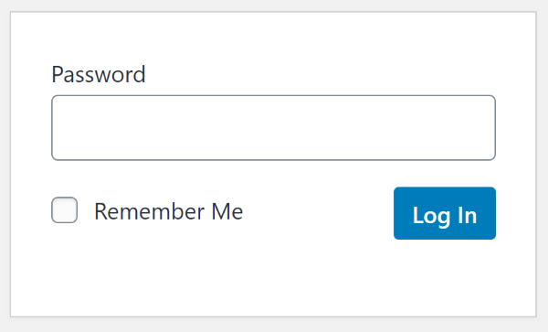
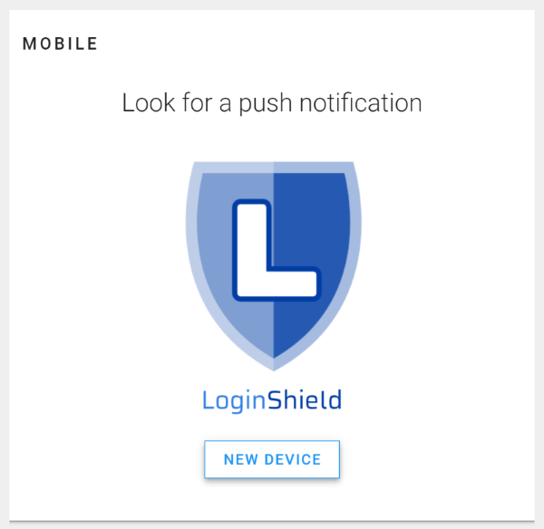
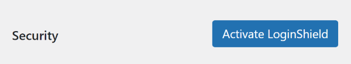
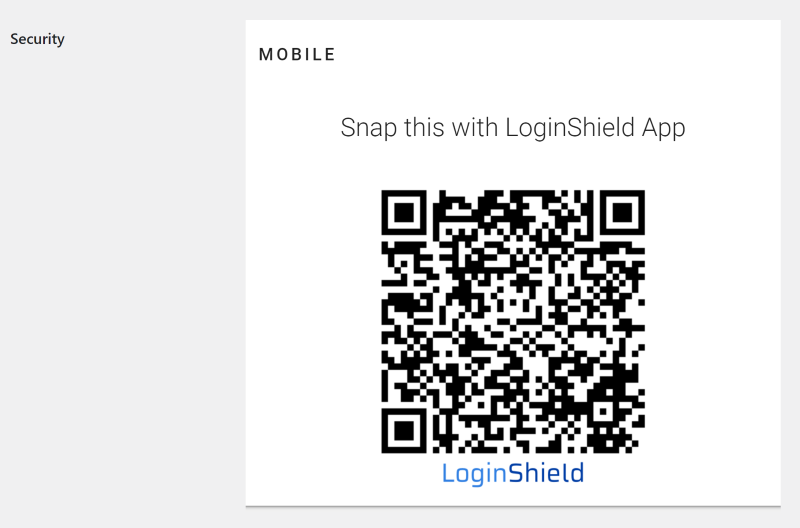
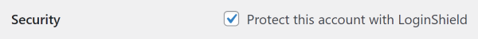
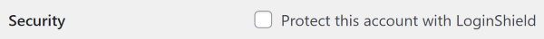
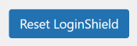

LoginShield Handbook
====================

[LoginShield](https://loginshield.com) is an authentication system that features one-tap login, digital signatures, strong multi-factor authentication, and phishing protection.

This handbook contains information for developers.

* [Website Integration](#website-integration)

Copyright (C) 2021 [Cryptium Corporation](https://cryptium.com)

This work is licensed under a [Creative Commons Attribution-ShareAlike 4.0 International License](http://creativecommons.org/licenses/by-sa/4.0/).

# Website Integration

LoginShield can be integrated into any website.

## Architecture

The components involved in a website integration are:

* Enterprise Website HTML/JS/CSS: this is your website, where you integrate or adapt the LoginShield Website SDK
* Enterprise API: this is your server-side code, where you use or adapt the LoginShield Server SDK
* Enterprise Database: you may need to add some fields to store LoginShield settings for your users
* LoginShield Iframe: the iframe runs code loaded from the LoginShield website and is only needed during user setup and user login

The LoginShield SDK includes the following components to help with the integration:

* LoginShield Website SDK: javascript to integrate into the website, which handles communication with the LoginShield iframe
* LoginShield Server SDK: server-side code showing how to call the LoginShield API

Both of the SDK components can be used directly or translated to your language/platform of choice.

## Server Configuration

To access the LoginShield API, you will need the following three settings:

* Endpoint URL (https://loginshield.com)
* Realm ID
* Authorization Token

There are two ways to obtain the Realm ID and Authorization Token:

* By hand: login to your enterprise account at the [LoginShield website](https://loginshield.com/), create the realm and the token
* Webauthz: integrate Webauthz into your website together with the LoginShield SDK, and use the auto-configuration feature

You may want to obtain the settings by hand if you are doing a "pilot" or "proof-of-concept" integration, and you have experience using other APIs that require authentication and writing code to manage the authorization tokens -- for example periodically creating a new token and replacing it in your web server configuration.

You may want to integrate Webauthz if you want to use an already-built token management system, or if your website is also a SaaS and you are offering optional LoginShield integration for your customers. When you integrate Webauthz, your customers can easily setup their own LoginShield account in minutes.

## User Experience

This section assumes your website already has a standard password login. If you are developing a new website and intend to skip passwords and use only LoginShield, check the [Alternative User Experience](#alternative-user-experience) section.

### Login

It is typical for websites using a password login to display a login form that contains both the username and password, like this:

Your website may have a similar login form. In this form there is a one-step process: the user submits their username and password. After you complete the LoginShield integration, your login form will use a two-step process:

1. The user submits their username. The website then checks if it's an existing user that has activated LoginShield protection for their account, or if it's an unknown user.
2. For existing users that activated LoginShield protection for their account, and for unknown users, display the LoginShield login activity; for existing users that have not activated LoginShield, display the password input.

An example of the 2-step login for password users:

An example of the 2-step login for LoginShield users:

### Setup and Activate LoginShield

A user with an existing account edits their account settings to setup LoginShield.

Where the user has not yet been registered with the LoginShield API (the `is_registered` flag is false), the account settings show a message that LoginShield is available and a button to continue. When the user taps the button, an indeterminate progress indicator is presented while the server registers the user with LoginShield. When the registration is complete (the `is_registered` flag is true and the `is_confirmed` flag is false), the account settings direct the user to the LoginShield setup activity to complete the LoginShield setup. This activity could be on a separate page or a section of the same page that would normally be hidden.

The LoginShield setup activity shows a message that the user must complete their first LoginShield login to continue, and shows the LoginShield login (the LoginShield iframe). The activity also shows a link `https://loginshield.com/software/` for users to download the LoginShield app for their device if they don't have it yet. The activity should show a message that the user must use the LoginShield app to snap the QR code.

When the user snaps the QR code with the LoginShield app, the LoginShield app will prompt the user to login or cancel. When the user chooses to login, the LoginShield app will show the user a safety notice with the option to continue by email or their mobile browser. When the user chooses to continue by email, LoginShield will send the user an email with a link to continue to your website. When the user chooses to continue by mobile browser, LoginShield will open a browser on the user's device to continue to your website. This step cannot be skipped and is an important part of the phishing protection.

When the user follows the link to return to the LoginShield setup activity on your website, the website will show a message that LoginShield setup is complete and that LoginShield is now activated to protect the user's account. If the LoginShield setup activity is on a separate page, it will show a link to return to account settings. If the LoginShield setup activity is a section in account settings, it will show a button to close the section.

When the user returns to account settings, the user sees that LoginShield is activated. 

### Activate LoginShield

A  user with an existing account and LoginShield setup but deactivated edits their account settings to activate LoginShield.

When the user taps the checkbox or switch control, the control changes to the "checked" or "on" position (the `is_activated` flag is true).

When LoginShield is activated, the account settings show a checkbox or switch control in the "checked" or "on" position and a statement that the user's account is currently protected by LoginShield.

### Deactivate LoginShield

A  user with an existing account with LoginShield setup and activated edits their account settings to deactivate LoginShield.

When the user taps the checkbox or switch control, the control changes to the "unchecked" or "off" position (the `is_activated` flag is false).

When LoginShield is deactivated, the account settings show a checkbox or switch control in the "unchecked" or "off" position and a warning that the user's account is currently NOT protected by LoginShield.

### Reset LoginShield

A user with an existing account with LoginShield setup and activated, but cannot log in because they lost their device, uses the reset account link to reset LoginShield.

This procedure is completely dependent on the website security procedures for identifying and authenticating users without their primary credential. It is the same procedure that would be used to reset a password. For some websites it is only an email verification, while for other websites additional steps are required such as answering security questions.

When the user has been authenticated, the website resets the LoginShield settings for the user (`is_registered` is false, `is_confirmed` is false, `is_activated` is false, but `loginshield_user_id` is left unchanged), then displays the account settings where user can setup LoginShield again.

## Alternative User Experience

If your website will be using LoginShield as the only login mechanism, the user experience will be different in the following ways:

* during account registration, proceed to the Setup and Activate LoginShield activity instead of setting the first password
* profile settings do not include the Activate Loginshield or Deactivate LoginShield actions because it is always activated
* login prompts for username, then displays the LoginShield login activity (also for unknown userame, to prevent user enumeration)

## SDK

The software development kit (SDK) involves the following components:

* Website
* Server

In the SDK, you will see references to an "authentication realm client", or more briefly "realm client", which is your website and server. The corresponding authentication server is LoginShield.

### Website

Your website needs to interact with your server to manage the user's LoginShield settings, and also to display the LoginShield iframe when needed (LoginShield setup and login).

* JavaScript: [realm-client-browser-js](https://github.com/LoginShield/realm-client-browser-js)

### Server

Your server needs to manage the user's LoginShield settings and interact with the LoginShield API to manage users and logins.

* NodeJS: [realm-client-node-js](https://github.com/LoginShield/realm-client-node-js)

## Database

You need to store the LoginShield settings for each user. In this section we suggest some field names, but you can call these whatever you want in your database.

* is_registered: Boolean, default false, indicates if the user has completed the registration step
* is_confirmed: Boolean, default false, indicates if the user has confirmed their LoginShield protection with a first login
* is_activated: Boolean, default false, indicates if the user has activated LoginShield protection for their account (must be registered first)
* loginshield_user_id: String, default null, a unique identifier for the user generated during the registration step

The `loginshield_user_id` is generated by your own code. You can generate a unique ID, store it, and use it to reference this user when calling the LoginShield API. Alternatively, you can skip generating and storing this field if you re-use an existing unique identifier for the user during registration, such as an existing primary key you already have. The unique id is permanent, so you SHOULD NOT use an email address for this if you allow users to change their email address.

## Security

### User Enumeration

In a standard username and password login form, user enumeration is prevented by returning a vague error message that either the username or password is incorrect.

In a two-step process, where the username is checked first, and the second step is selected based on the user's settings, the user enumeration attack is prevented by choosing a default login mechanism for unknown users and then, when the login inevitably fails because the user does not exist, presenting a similar vague error message about the failed login.

You can choose any of your login mechanisms (password, LoginShield) as the default. The remainder of this section is a discussion about the advantages and disadvantages of each one as the default.

#### Default login with password

If you choose password as the default, the response for a failed login will be the same vague message that either the username or password is incorrect. This protects your password users from enumeration, but may reveal some existing usernames to attackers because when they see the LoginShield QR code, they know they found an existing username. However, knowledge of the username will not help the attackers break into the account because it's protected by LoginShield and the existing techniques for dictionary attacks or exhaustive search of passwords will not work against the LoginShield-protected account.

Using password as the default provides the following advantages:

* password users have safety in numbers

If you choose LoginShield as the default, the response for a failed login will be a similar vague message that the login failed. This protects your LoginShield users from enumeration, but may reveal some existing password-using usernames to attackers because when they see the password prompt they know they found an existing username. Attackers would then proceed to use their existing techniques of dictionary attacks or exhaustive search on the known user accounts.

### Default login with LoginShield

Using LoginShield as the default offers the following advantages:

* larger search space; an attacker may attempt user enumeration in combination with a "dictionary attack" on the password; they have a small chance of finding a match and for that small chance they will hammer your server with many attempted logins; however, when the default login mechanism for an unknown user is LoginShield, attackers know they have practically zero chance of succeeding with an exhaustive search attack on the private key used to generate the digital signature, and to even attempt this they need to invest a significant amount of resources

* rate limiting automated attacks; while LoginShield is quick and easy for users, the LoginShield servers automatically apply rate limiting to unknown clients so their exhaustive search attack is even slower; even if you already have similar functionality on your website, you can offload that traffic to LoginShield to free up some of your own server resources; LoginShield does not charge for failed login attempts

## Examples

The following open-source example integrations are available:

* A sample enterprise [website](https://github.com/LoginShield/test-enterprise-website-html5) with [server](https://github.com/LoginShield/test-enterprise-service-node-js); see the [Enterprise Test Environment Handbook](https://github.com/LoginShield/test-enterprise-handbook) for setup information
* LoginShield for WordPress [source code](https://github.com/LoginShield/wordpress-plugin)
